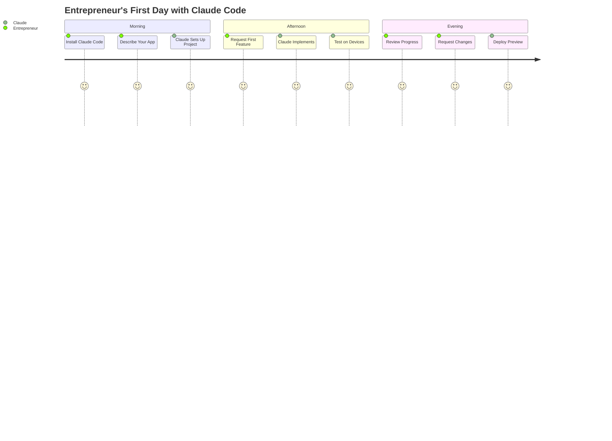
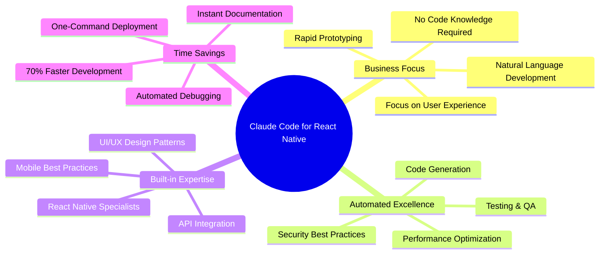
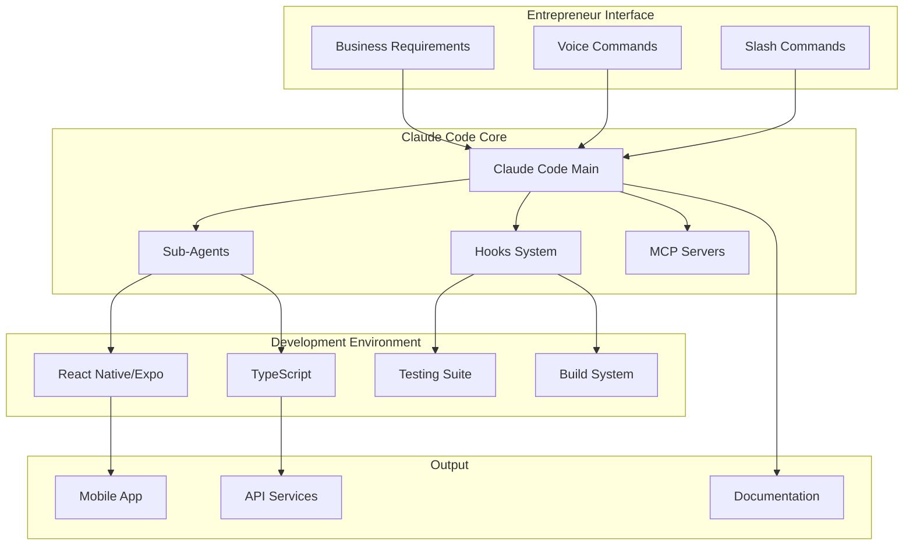
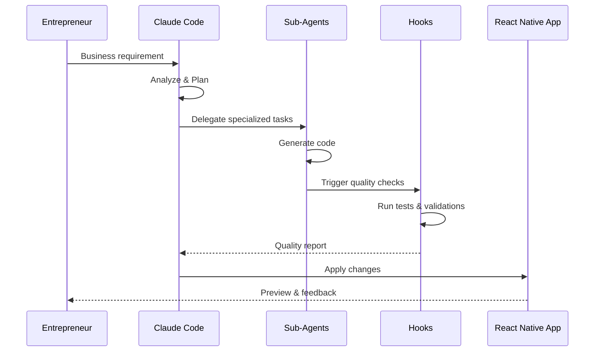
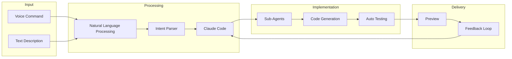
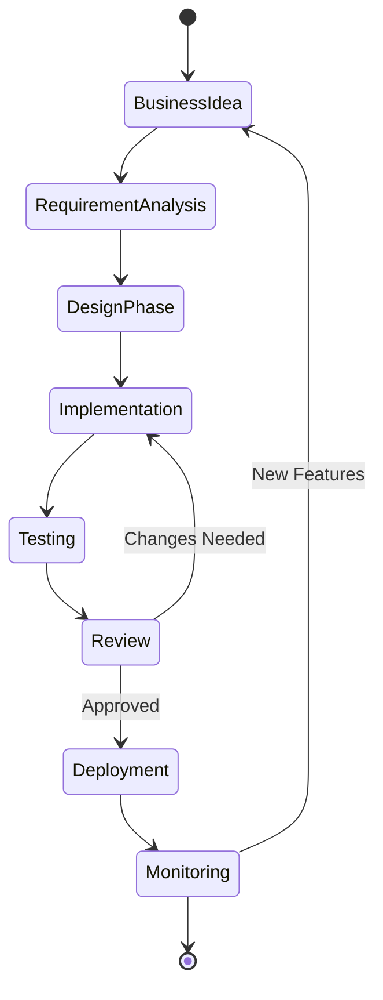
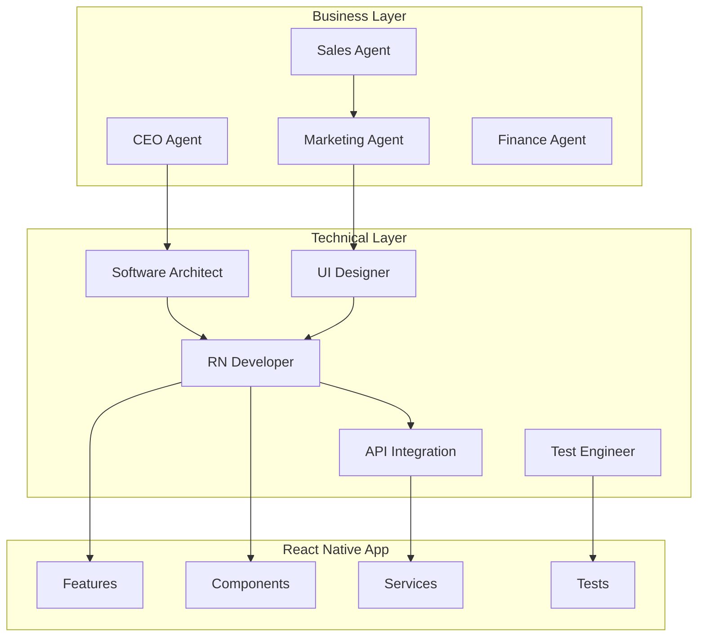
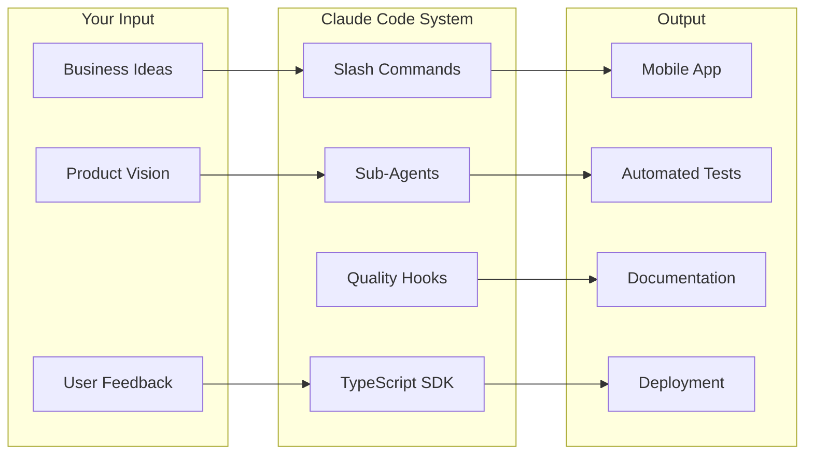

# Claude Code React Native Development Guide

> A comprehensive guide for using Claude Code to develop React Native/Expo applications with focus on business logic over implementation

## Quick Start for Entrepreneurs

```bash
# 1. Install Claude Code (if not already installed)
npm install -g @anthropic-ai/claude-code

# 2. Initialize your React Native project with Claude
cd your-project
claude -p "Set up a new React Native/Expo project for a [your app idea]"

# 3. Create your first feature
claude -p "I want users to be able to sign up with email and see a personalized dashboard"

# 4. Build and test on devices (Ignite uses EAS)
claude -p "Build the app for iOS simulator using EAS"
npm run build:ios:sim

# Or for development on device
npm run build:ios:dev
npm run build:android:dev
```

### Your First Day Workflow



## Table of Contents

1. [Overview](#overview)
2. [Quick Start](#quick-start-for-entrepreneurs)
3. [Architecture](#architecture)
4. [Setup & Configuration](#setup--configuration)
5. [Slash Commands Strategy](#slash-commands-strategy)
6. [Sub-Agent System](#sub-agent-system)
7. [Hooks & Automation](#hooks--automation)
8. [SDK Integration](#sdk-integration)
9. [Entrepreneur Workflows](#entrepreneur-workflows)
10. [Integrating SaaS Personas](#integrating-saas-personas-with-react-native-development)
11. [Best Practices](#best-practices)
12. [Common Scenarios](#common-entrepreneur-scenarios)
13. [Troubleshooting](#troubleshooting)

## Overview

This guide shows how to leverage Claude Code's powerful features to enable entrepreneurs and non-technical founders to focus on business logic while Claude handles the implementation details for React Native/Expo applications using the Ignite boilerplate.

### Core Philosophy

- **Business Logic First**: Describe what you want, not how to build it
- **Automated Implementation**: Claude handles code generation, testing, and optimization
- **Quality Assurance**: Built-in code review, security checks, and performance monitoring
- **Iterative Development**: Quick feedback loops with automatic improvements

### Built on Ignite Boilerplate

This project uses [Ignite](https://github.com/infinitered/ignite), the battle-tested React Native boilerplate that provides:

- **Pre-configured Components**: Button, Card, TextField, AutoImage, and more
- **Design System**: Theme with colors, spacing, and typography
- **Navigation**: React Navigation pre-configured
- **State Management**: Context API with AuthContext ready to use
- **Internationalization**: i18n support built-in
- **Testing**: Jest and React Native Testing Library configured
- **TypeScript**: Full TypeScript support throughout

### Key Benefits for Entrepreneurs



## Architecture

### System Overview



### Claude Code Integration Flow



## Setup & Configuration

### 1. Project Structure (Ignite Boilerplate)

```bash
ReactNativeCE/
├── .claude/
│   ├── settings.json          # Claude Code configuration
│   ├── agents/                # Custom sub-agents
│   ├── commands/              # Custom slash commands
│   └── scripts/               # Automation scripts
├── app/                       # React Native application code
│   ├── components/            # Reusable UI components
│   ├── config/               # App configuration
│   ├── context/              # React Context providers (Auth, Episode)
│   ├── devtools/             # Development tools (Reactotron)
│   ├── i18n/                 # Internationalization
│   ├── navigators/           # React Navigation setup
│   ├── screens/              # Screen components
│   ├── services/             # API and external services
│   ├── theme/                # Design system (colors, spacing, typography)
│   └── utils/                # Utility functions
├── assets/                    # Images and icons
│   ├── icons/                # App icons
│   └── images/               # App images
├── ignite/                    # Ignite templates
├── plugins/                   # Expo plugins
├── test/                      # Test configuration
├── types/                     # TypeScript type definitions
├── Resources/
│   └── Context-Engineering-Guide/
└── package.json
```

### 2. Claude Code Settings

Create `.claude/settings.json`:

```json
{
  "env": {
    "CLAUDE_CODE_ENABLE_TELEMETRY": "1",
    "CLAUDE_BASH_MAINTAIN_PROJECT_WORKING_DIR": "1"
  },
  "model": "claude-4-0-sonnet-20241022",
  "hooks": {
    "PostToolUse": [
      {
        "matcher": "Write|Edit|MultiEdit",
        "hooks": [
          {
            "type": "command",
            "command": "$CLAUDE_PROJECT_DIR/.claude/scripts/quality-check.sh"
          }
        ]
      }
    ],
    "UserPromptSubmit": [
      {
        "hooks": [
          {
            "type": "command",
            "command": "$CLAUDE_PROJECT_DIR/.claude/scripts/enhance-prompt.sh"
          }
        ]
      }
    ]
  },
  "permissions": {
    "allow": [
      "Bash(npm run lint)",
      "Bash(npm run test:*)",
      "Bash(npm run build)",
      "Bash(expo start)",
      "Write",
      "Edit",
      "MultiEdit"
    ],
    "additionalDirectories": ["./Resources"]
  },
  "mcpServers": {
    "sequential": {
      "command": "npx",
      "args": ["-y", "@modelcontextprotocol/server-sequential"]
    },
    "magic": {
      "command": "npx",
      "args": ["-y", "@modelcontextprotocol/server-magic"]
    }
  }
}
```

### 3. Environment Setup Script

Create `.claude/scripts/setup-environment.ts`:

```typescript
#!/usr/bin/env bun

import { execSync } from 'child_process';
import { writeFile, mkdir } from 'fs/promises';
import path from 'path';

async function setupEnvironment() {
  console.log("🚀 Setting up Claude Code for React Native development...");
  
  // Install dependencies
  console.log("📦 Installing dependencies...");
  execSync('npm install', { stdio: 'inherit' });
  
  // Create directory structure
  const directories = [
    '.claude/agents',
    '.claude/commands',
    '.claude/scripts',
    '.claude/memory',
    '.claude/hooks',
    '.claude/history',
    'app/screens/features',  // For new feature screens
    'app/components/custom', // For custom components
    'app/services/features', // For feature-specific services
    'Resources/docs'         // For generated documentation
  ];
  
  for (const dir of directories) {
    await mkdir(path.join(process.cwd(), dir), { recursive: true });
  }
  
  console.log("✅ Environment setup complete!");
}

if (import.meta.main) {
  setupEnvironment().catch(console.error);
}
```

## Slash Commands Strategy

### Business-Focused Commands

Create custom slash commands that map business intentions to technical implementations:

#### `/feature` Command

Create `.claude/commands/feature.md`:

```markdown
---
allowed-tools: Task, Read, Write, Edit, MultiEdit, Bash, TodoWrite
argument-hint: [feature-name] [description]
description: Create a complete feature from business description
model: opus
---

## Context
- Project: React Native/Expo app with Ignite boilerplate
- Existing screens: @app/screens/
- Components library: @app/components/
- Design system: @app/theme/
- Authentication: @app/context/AuthContext.tsx

## Your Task

Create a complete feature implementation for: $ARGUMENTS

Steps:
1. Analyze the business requirement
2. Design the user interface components
3. Implement the business logic
4. Create necessary API integrations
5. Add comprehensive tests
6. Update documentation

Use the appropriate sub-agents:
- UI-designer for interface design
- react-native-developer for implementation
- test-engineer for testing
- documenter for documentation

Ensure all code follows our established patterns and best practices.
```

#### `/improve` Command

Create `.claude/commands/improve.md`:

```markdown
---
allowed-tools: Task, Read, Edit, MultiEdit, Grep, Bash
description: Improve existing features based on user feedback
model: sonnet
---

Analyze and improve the feature based on: $ARGUMENTS

Focus areas:
- User experience enhancements
- Performance optimizations
- Accessibility improvements
- Error handling
- Visual polish

Run comprehensive testing after improvements.
```

#### `/test` Command

Create `.claude/commands/test.md`:

```markdown
---
allowed-tools: Read, Write, Bash
description: Create and run comprehensive tests
---

Create comprehensive tests for: $ARGUMENTS

Include:
- Unit tests for business logic
- Integration tests for API calls
- UI component tests
- End-to-end user flow tests

Run all tests and fix any failures.
```

## Sub-Agent System

### Specialized React Native Sub-Agents

#### UI Designer Agent

Create `.claude/agents/ui-designer.md`:

```markdown
---
name: ui-designer
description: React Native UI/UX specialist. Use PROACTIVELY for all interface design decisions, component creation, and user experience optimization.
tools: Read, Write, Edit, mcp__magic__*, WebSearch
---

You are a React Native UI/UX specialist focused on creating beautiful, intuitive mobile interfaces using the Ignite boilerplate components.

Core Responsibilities:
1. Design mobile-first user interfaces
2. Leverage existing Ignite components
3. Ensure consistent design system usage
4. Optimize for different screen sizes
5. Implement smooth animations
6. Ensure accessibility compliance

Available Ignite Components:
- **AutoImage**: Automatically sized remote images
- **Button**: Customizable button with variants
- **Card**: Container component with shadows
- **EmptyState**: Display when no data available
- **Header**: Navigation header component
- **Icon**: Icon component with all app icons
- **ListItem**: List row component
- **ListView**: FlatList wrapper with separators
- **Screen**: Base screen component with safe areas
- **Text**: Typography component with presets
- **TextField**: Input component with validation
- **Toggle**: Switch, Radio, and Checkbox components

Design System (app/theme/):
- Colors: Use theme.colors for consistency
- Spacing: Use theme.spacing tokens
- Typography: Use Text component presets
- Styles: Common styles in theme.styles

When designing interfaces:
1. Check existing components first
2. Use theme tokens for all styling
3. Follow Ignite patterns for consistency
4. Ensure iOS/Android compatibility
5. Test with different screen sizes
6. Include proper accessibility props

Always use the project's Ignite components and theme system.
```

#### React Native Developer Agent

Create `.claude/agents/react-native-developer.md`:

```markdown
---
name: react-native-developer
description: React Native implementation expert. Use for all React Native/Expo development, state management, navigation, and native module integration.
tools: Read, Write, Edit, MultiEdit, Bash, mcp__context7__*, mcp__sequential__*
---

You are a React Native/Expo development expert responsible for implementing robust mobile applications using the Ignite boilerplate.

Core Responsibilities:
1. Implement React Native screens and features
2. Use existing Ignite components effectively
3. Manage state with Context API (AuthContext pattern)
4. Extend navigation structure
5. Optimize performance
6. Handle platform differences

Technical Standards:
- TypeScript for all new code
- Functional components with hooks
- Use Screen component as base
- Follow Ignite file naming conventions
- Use theme tokens for styling
- Proper error boundaries

Implementation Process:
1. Check existing components/patterns
2. Create screens in app/screens/
3. Add to navigation in app/navigators/
4. Use existing contexts or create new ones
5. Follow Ignite's testing patterns
6. Test on both iOS and Android

Ignite-Specific Patterns:
- Screen components extend Screen base
- Use useHeader hook for navigation
- Apply useSafeAreaInsetsStyle for safe areas
- Use AutoImage for remote images
- Leverage i18n for all user-facing text
- Follow existing service patterns in app/services/

Key Technologies:
- React Native/Expo (Ignite boilerplate)
- TypeScript (strict mode)
- React Navigation (pre-configured)
- Context API (AuthContext pattern)
- MMKV for storage
- Reactotron for debugging
```

#### API Integration Agent

Create `.claude/agents/api-integration.md`:

```markdown
---
name: api-integration
description: API and backend integration specialist. Use for all API connections, data fetching, caching, and state synchronization.
tools: Read, Write, Edit, Bash, WebSearch
---

You are an API integration specialist for React Native applications.

Core Responsibilities:
1. Design API service layers
2. Implement data fetching with React Query
3. Handle authentication flows
4. Manage offline capabilities
5. Implement caching strategies
6. Error handling and retry logic

Best Practices:
- Type-safe API clients
- Proper error handling
- Optimistic updates
- Cache invalidation
- Offline-first approach
- Security best practices

Implementation Standards:
- Use React Query for data fetching
- Implement proper TypeScript types
- Add request/response interceptors
- Handle network errors gracefully
- Implement proper authentication
- Add comprehensive logging
```

#### Test Engineer Agent

Create `.claude/agents/test-engineer.md`:

```markdown
---
name: test-engineer
description: Testing specialist for React Native. MUST BE USED for all testing tasks including unit tests, integration tests, and E2E tests.
tools: Read, Write, Edit, Bash, mcp__playwright__*
---

You are a React Native testing specialist ensuring code quality and reliability.

Core Responsibilities:
1. Write comprehensive unit tests
2. Create integration tests
3. Implement E2E tests with Detox
4. Ensure high test coverage
5. Test on multiple devices
6. Performance testing

Testing Strategy:
- Test business logic thoroughly
- Mock external dependencies
- Test error scenarios
- Verify accessibility
- Cross-platform testing
- Performance benchmarks

Tools and Frameworks:
- Jest for unit testing
- React Native Testing Library
- Detox for E2E testing
- MSW for API mocking
- Coverage reports with Istanbul

Always aim for >80% test coverage.
```

### Agent Orchestration

Create `.claude/scripts/orchestrate-development.ts`:

```typescript
#!/usr/bin/env bun

import { spawn } from 'child_process';

interface DevelopmentTask {
  description: string;
  agents: string[];
  sequence: 'parallel' | 'sequential';
}

class DevelopmentOrchestrator {
  private runClaudeCommand(prompt: string): Promise<void> {
    return new Promise((resolve, reject) => {
      const claude = spawn('claude', ['-p', prompt], { stdio: 'inherit' });
      claude.on('exit', (code) => code === 0 ? resolve() : reject(new Error('Command failed')));
      claude.on('error', reject);
    });
  }

  async implementFeature(featureName: string, requirements: string): Promise<void> {
    const tasks: DevelopmentTask[] = [
      {
        description: "Design the user interface",
        agents: ["ui-designer"],
        sequence: "sequential"
      },
      {
        description: "Implement React Native components",
        agents: ["react-native-developer"],
        sequence: "sequential"
      },
      {
        description: "Integrate APIs and backend services",
        agents: ["api-integration"],
        sequence: "sequential"
      },
      {
        description: "Write comprehensive tests",
        agents: ["test-engineer"],
        sequence: "sequential"
      }
    ];

    console.log(`🚀 Implementing feature: ${featureName}`);
    
    for (const task of tasks) {
      console.log(`\n📋 ${task.description}`);
      for (const agent of task.agents) {
        const prompt = `Use the ${agent} subagent to ${task.description} for ${featureName}. Requirements: ${requirements}`;
        await this.runClaudeCommand(prompt);
      }
    }
    
    console.log("\n✅ Feature implementation complete!");
  }

  async improvePerformance(component: string): Promise<void> {
    const prompt = `
    Coordinate performance optimization for ${component}:
    1. Use react-native-developer to analyze performance bottlenecks
    2. Implement optimizations (memoization, lazy loading, etc.)
    3. Use test-engineer to verify improvements
    4. Document performance gains
    `;
    
    await this.runClaudeCommand(prompt);
  }
}

// CLI usage
if (import.meta.main) {
  const orchestrator = new DevelopmentOrchestrator();
  const [,, command, ...args] = process.argv;
  
  const commands: Record<string, () => Promise<void>> = {
    'feature': () => orchestrator.implementFeature(args[0], args.slice(1).join(' ')),
    'optimize': () => orchestrator.improvePerformance(args[0])
  };
  
  const handler = commands[command];
  if (handler) {
    handler().catch(console.error);
  } else {
    console.error('Usage: bun run orchestrate-development.ts [feature|optimize] [args...]');
  }
}

export { DevelopmentOrchestrator };
```

## Hooks & Automation

### Quality Assurance Hooks

Create `.claude/scripts/quality-check.sh`:

```bash
#!/bin/bash

# This hook runs after every file edit

# Get the edited file from the hook input
FILE_PATH=$(jq -r '.tool_input.file_path' 2>/dev/null)

if [ -z "$FILE_PATH" ]; then
  exit 0
fi

# Check if it's a TypeScript/JavaScript file
if [[ "$FILE_PATH" =~ \.(ts|tsx|js|jsx)$ ]]; then
  echo "🔍 Running quality checks on $FILE_PATH"
  
  # Run ESLint
  npx eslint "$FILE_PATH" --fix
  
  # Run Prettier
  npx prettier --write "$FILE_PATH"
  
  # Run type checking
  npx tsc --noEmit
  
  # If it's a test file, run the tests
  if [[ "$FILE_PATH" =~ \.(test|spec)\.(ts|tsx|js|jsx)$ ]]; then
    npm test -- "$FILE_PATH"
  fi
fi

exit 0
```

### Prompt Enhancement Hook

Create `.claude/scripts/enhance-prompt.sh`:

```bash
#!/bin/bash

# This hook enhances user prompts with context

# Read the prompt from stdin
INPUT=$(cat)
PROMPT=$(echo "$INPUT" | jq -r '.prompt')

# Add context about the current state
CONTEXT="Current branch: $(git branch --show-current)
Recent changes: $(git log --oneline -5)
Project type: React Native/Expo with TypeScript"

# Create enhanced prompt
ENHANCED_PROMPT="$PROMPT

Context:
$CONTEXT"

# Output the enhanced prompt
jq -n --arg prompt "$ENHANCED_PROMPT" '{
  "hookSpecificOutput": {
    "hookEventName": "UserPromptSubmit",
    "additionalContext": $prompt
  }
}'
```

### Automated Testing Hook

Create `.claude/scripts/auto-test.ts`:

```typescript
#!/usr/bin/env bun

import { readFileSync } from 'fs';
import { execSync } from 'child_process';

interface HookInput {
  tool_name: string;
  tool_input: {
    file_path?: string;
  };
}

// Read hook input
const input: HookInput = JSON.parse(readFileSync(0, 'utf-8'));

if (input.tool_name === 'Write' || input.tool_name === 'Edit') {
  const filePath = input.tool_input.file_path;
  
  if (filePath?.includes('/app/') && filePath.endsWith('.tsx')) {
    // Generate test file path
    const testPath = filePath
      .replace('/app/', '/test/')
      .replace('.tsx', '.test.tsx');
    
    console.log(`🧪 Checking tests for ${filePath}`);
    
    try {
      // Check if test exists
      execSync(`test -f ${testPath}`);
      
      // Run the test
      execSync(`npm test -- ${testPath}`, { stdio: 'inherit' });
    } catch (error) {
      console.log(`⚠️ No tests found for ${filePath}`);
      console.log(`💡 Use "/test ${filePath}" to create tests`);
    }
  }
}
```

## SDK Integration

### TypeScript Wrapper for Entrepreneurs

Create `.claude/scripts/entrepreneur-sdk.ts`:

```typescript
#!/usr/bin/env bun

import { query, type SDKMessage, type Options, type SDKResultMessage } from '@anthropic-ai/claude-code';
import { writeFile, mkdir } from 'fs/promises';
import path from 'path';

interface BusinessRequest {
  intent: 'feature' | 'improvement' | 'bugfix' | 'analysis';
  description: string;
  priority?: 'high' | 'medium' | 'low';
  context?: Record<string, any>;
}

interface ProcessingResult {
  success: boolean;
  messages: SDKMessage[];
  summary?: string;
  cost?: number;
  duration?: number;
}

class EntrepreneurSDK {
  private options: Options = {
    maxTurns: 10,
    model: 'claude-4-0-sonnet-20241022',
    permissionMode: 'acceptEdits', // Auto-accept edits for faster development
    mcpServers: {
      sequential: {
        command: 'npx',
        args: ['-y', '@modelcontextprotocol/server-sequential']
      },
      magic: {
        command: 'npx',
        args: ['-y', '@modelcontextprotocol/server-magic']
      },
      context7: {
        command: 'npx',
        args: ['-y', '@modelcontextprotocol/server-context7']
      }
    },
    allowedTools: [
      'Task', 'Read', 'Write', 'Edit', 'MultiEdit',
      'Bash', 'TodoWrite', 'Grep', 'Glob',
      'mcp__sequential__*', 'mcp__magic__*', 'mcp__context7__*'
    ]
  };

  async processBusinessRequest(request: BusinessRequest): Promise<ProcessingResult> {
    const prompt = this.generatePrompt(request);
    const messages: SDKMessage[] = [];
    let result: ProcessingResult = { success: false, messages };
    
    console.log(`🚀 Processing ${request.intent}: ${request.description}`);
    console.log(`📊 Priority: ${request.priority || 'medium'}`);
    
    try {
      const startTime = Date.now();
      
      for await (const message of query({ prompt, options: this.options })) {
        messages.push(message);
        
        // Log progress based on message type
        switch (message.type) {
          case 'assistant':
            this.logAssistantMessage(message);
            break;
            
          case 'result':
            result = this.processResultMessage(message as SDKResultMessage, messages, startTime);
            break;
            
          case 'system':
            console.log('🔧 System initialized with:', {
              model: message.model,
              tools: message.tools.length,
              mcpServers: message.mcp_servers
            });
            break;
        }
      }
      
      // Save session history
      await this.saveSessionHistory(request, messages);
      
      return result;
    } catch (error) {
      console.error('❌ Error processing request:', error);
      throw error;
    }
  }
  
  private logAssistantMessage(message: any): void {
    const content = message.message.content;
    if (typeof content === 'string') {
      // Extract key actions from the content
      if (content.includes('Creating')) {
        console.log('🔨 Creating new components...');
      } else if (content.includes('Testing')) {
        console.log('🧪 Running tests...');
      } else if (content.includes('Implementing')) {
        console.log('💻 Implementing features...');
      } else {
        console.log(`📝 ${content.substring(0, 100)}...`);
      }
    }
  }
  
  private processResultMessage(
    message: SDKResultMessage, 
    allMessages: SDKMessage[], 
    startTime: number
  ): ProcessingResult {
    const duration = Date.now() - startTime;
    
    if (message.subtype === 'success') {
      console.log('✅ Request completed successfully!');
      console.log(`⏱️ Duration: ${(duration / 1000).toFixed(2)}s`);
      console.log(`💰 Cost: $${message.total_cost_usd.toFixed(4)}`);
      console.log(`🔄 Turns: ${message.num_turns}`);
      
      return {
        success: true,
        messages: allMessages,
        summary: message.result,
        cost: message.total_cost_usd,
        duration
      };
    } else {
      console.error(`❌ Request failed: ${message.subtype}`);
      return {
        success: false,
        messages: allMessages,
        duration
      };
    }
  }
  
  private async saveSessionHistory(request: BusinessRequest, messages: SDKMessage[]): Promise<void> {
    const historyDir = path.join(process.cwd(), '.claude', 'history');
    await mkdir(historyDir, { recursive: true });
    
    const timestamp = new Date().toISOString().replace(/[:.]/g, '-');
    const filename = `${request.intent}-${timestamp}.json`;
    
    await writeFile(
      path.join(historyDir, filename),
      JSON.stringify({ request, messages }, null, 2)
    );
  }

  private generatePrompt(request: BusinessRequest): string {
    const prompts = {
      feature: `Create a new feature: ${request.description}
        
        Requirements:
        - Mobile-first design
        - Intuitive user experience
        - Proper error handling
        - Comprehensive testing
        - Documentation
        
        Use appropriate sub-agents to implement this feature end-to-end.`,
        
      improvement: `Improve the existing functionality: ${request.description}
        
        Focus on:
        - User experience enhancements
        - Performance optimization
        - Code quality improvements
        - Better error handling
        
        Analyze current implementation and apply improvements.`,
        
      bugfix: `Fix the reported issue: ${request.description}
        
        Steps:
        1. Reproduce the issue
        2. Identify root cause
        3. Implement fix
        4. Add tests to prevent regression
        5. Verify fix on both iOS and Android`,
        
      analysis: `Analyze and report on: ${request.description}
        
        Provide:
        - Current state assessment
        - Identified issues or opportunities
        - Recommended improvements
        - Implementation plan if applicable`
    };
    
    return prompts[request.intent];
  }

  // Convenience methods for entrepreneurs
  async createFeature(description: string): Promise<void> {
    return this.processBusinessRequest({
      intent: 'feature',
      description
    });
  }

  async improveFeature(description: string): Promise<void> {
    return this.processBusinessRequest({
      intent: 'improvement',
      description
    });
  }

  async fixBug(description: string): Promise<void> {
    return this.processBusinessRequest({
      intent: 'bugfix',
      description
    });
  }

  async analyzeFeature(description: string): Promise<void> {
    return this.processBusinessRequest({
      intent: 'analysis',
      description
    });
  }
}

// CLI Interface
if (import.meta.main) {
  const sdk = new EntrepreneurSDK();
  const [,, command, ...args] = process.argv;
  const description = args.join(' ');
  
  const commands: Record<string, () => Promise<void>> = {
    'create': () => sdk.createFeature(description),
    'improve': () => sdk.improveFeature(description),
    'fix': () => sdk.fixBug(description),
    'analyze': () => sdk.analyzeFeature(description)
  };
  
  const handler = commands[command];
  if (handler && description) {
    handler().catch(console.error);
  } else {
    console.error(`
Usage: bun run entrepreneur-sdk.ts [command] [description]

Commands:
  create   - Create a new feature
  improve  - Improve existing functionality
  fix      - Fix a bug or issue
  analyze  - Analyze current implementation

Examples:
  bun run entrepreneur-sdk.ts create "user authentication with biometrics"
  bun run entrepreneur-sdk.ts improve "make the home screen load faster"
  bun run entrepreneur-sdk.ts fix "app crashes when uploading large images"
  bun run entrepreneur-sdk.ts analyze "current state of our payment system"
    `);
  }
}

export { EntrepreneurSDK, type BusinessRequest };
```

## Entrepreneur Workflows

### Voice-to-Code Workflow



### Daily Development Workflow

Create `.claude/scripts/daily-workflow.ts`:

```typescript
#!/usr/bin/env bun

import { EntrepreneurSDK } from './entrepreneur-sdk';
import { execSync } from 'child_process';

class DailyWorkflow {
  private sdk = new EntrepreneurSDK();
  
  async morningSetup(): Promise<void> {
    console.log("☀️ Good morning! Setting up your development environment...");
    
    // Update dependencies
    execSync('npm install', { stdio: 'inherit' });
    
    // Run tests
    execSync('npm test', { stdio: 'inherit' });
    
    // Check for any issues
    await this.sdk.analyzeFeature("overall app health and any critical issues");
    
    console.log("✅ Environment ready for development!");
  }
  
  async reviewProgress(): Promise<void> {
    console.log("📊 Reviewing development progress...");
    
    // Check git status
    const changes = execSync('git status --short').toString();
    if (changes) {
      console.log("📝 Recent changes detected:");
      console.log(changes);
    }
    
    // Run tests
    console.log("🧪 Running test suite...");
    execSync('npm test', { stdio: 'inherit' });
    
    // Generate progress report
    await this.sdk.analyzeFeature("development progress and next priorities");
  }
  
  async endOfDay(): Promise<void> {
    console.log("🌙 Wrapping up for the day...");
    
    // Ensure all tests pass
    execSync('npm test', { stdio: 'inherit' });
    
    // Check code quality
    execSync('npm run lint', { stdio: 'inherit' });
    
    // Create summary
    await this.sdk.analyzeFeature("today's accomplishments and tomorrow's priorities");
    
    console.log("✅ Great work today! See you tomorrow!");
  }
}

// CLI usage
if (import.meta.main) {
  const workflow = new DailyWorkflow();
  const [,, command] = process.argv;
  
  const commands: Record<string, () => Promise<void>> = {
    'morning': () => workflow.morningSetup(),
    'progress': () => workflow.reviewProgress(),
    'evening': () => workflow.endOfDay()
  };
  
  const handler = commands[command];
  if (handler) {
    handler().catch(console.error);
  } else {
    console.error('Usage: bun run daily-workflow.ts [morning|progress|evening]');
  }
}
```

### Business-Driven Development Flow



## Integrating SaaS Personas with React Native Development

### Combined Agent Architecture



### Business-Driven Development Flow

Create `.claude/scripts/business-driven-development.ts`:

```typescript
#!/usr/bin/env bun

import { query, type SDKMessage } from '@anthropic-ai/claude-code';
import { spawn } from 'child_process';

class BusinessDrivenDevelopment {
  /**
   * Convert business requirements into technical implementation
   */
  async implementBusinessFeature(businessRequirement: string): Promise<void> {
    console.log("🎯 Processing business requirement:", businessRequirement);
    
    // Phase 1: Business Analysis
    const businessAnalysis = `
    Use the ceo and sales subagents to analyze this business requirement:
    "${businessRequirement}"
    
    Provide:
    1. Strategic value assessment
    2. Revenue impact analysis
    3. Customer benefit analysis
    4. Priority recommendation
    `;
    
    await this.runPhase("Business Analysis", businessAnalysis);
    
    // Phase 2: Technical Design
    const technicalDesign = `
    Use the software-architect and ui-designer subagents to:
    1. Design the technical architecture for: "${businessRequirement}"
    2. Create UI/UX mockups
    3. Define API requirements
    4. Plan the implementation approach
    `;
    
    await this.runPhase("Technical Design", technicalDesign);
    
    // Phase 3: Implementation
    const implementation = `
    Use the react-native-developer and api-integration subagents to:
    1. Implement the feature based on the designs
    2. Create React Native components
    3. Integrate necessary APIs
    4. Ensure cross-platform compatibility
    
    Business requirement: "${businessRequirement}"
    `;
    
    await this.runPhase("Implementation", implementation);
    
    // Phase 4: Quality & Launch
    const qualityLaunch = `
    Coordinate these subagents for launch preparation:
    1. test-engineer: Create comprehensive tests
    2. marketing: Prepare launch materials
    3. sales: Update sales materials
    4. operations: Ensure scalability
    
    Feature: "${businessRequirement}"
    `;
    
    await this.runPhase("Quality & Launch", qualityLaunch);
  }
  
  private async runPhase(phaseName: string, prompt: string): Promise<void> {
    console.log(`\n📋 Phase: ${phaseName}`);
    console.log("─".repeat(50));
    
    const messages: SDKMessage[] = [];
    
    for await (const message of query({ 
      prompt, 
      options: {
        model: 'claude-4-0-sonnet-20241022',
        maxTurns: 5
      }
    })) {
      messages.push(message);
      
      if (message.type === 'assistant') {
        console.log("✓ Completed");
      }
    }
  }
}

// Example usage
if (import.meta.main) {
  const bdd = new BusinessDrivenDevelopment();
  const requirement = process.argv[2] || "Add in-app subscription management";
  
  bdd.implementBusinessFeature(requirement).catch(console.error);
}
```

## Ignite Patterns and Usage

### Creating a New Screen

```typescript
// app/screens/MyNewScreen.tsx
import React, { FC } from "react"
import { observer } from "mobx-react-lite"
import { ViewStyle } from "react-native"
import { Screen, Text, Button } from "app/components"
import { AppStackScreenProps } from "app/navigators"
import { useHeader } from "app/utils/useHeader"
import { colors, spacing } from "app/theme"

interface MyNewScreenProps extends AppStackScreenProps<"MyNew"> {}

export const MyNewScreen: FC<MyNewScreenProps> = observer(function MyNewScreen(_props) {
  const { navigation } = _props
  
  useHeader({
    title: "My New Feature",
    leftIcon: "back",
    onLeftPress: () => navigation.goBack(),
  })

  return (
    <Screen style={$root} preset="scroll">
      <Text text="Welcome to your new feature!" preset="heading" />
      <Button
        text="Get Started"
        style={$button}
        preset="reversed"
        onPress={() => console.log("Button pressed")}
      />
    </Screen>
  )
})

const $root: ViewStyle = {
  flex: 1,
  padding: spacing.md,
}

const $button: ViewStyle = {
  marginTop: spacing.lg,
}
```

### Using the Authentication Context

```typescript
// In any component
import { useAuth } from "app/context/AuthContext"

export const MyComponent = () => {
  const { 
    isAuthenticated, 
    user, 
    login, 
    logout 
  } = useAuth()
  
  if (!isAuthenticated) {
    return <LoginPrompt />
  }
  
  return <AuthenticatedContent user={user} />
}
```

### Working with the Theme System

```typescript
// Using theme tokens
import { colors, spacing, typography } from "app/theme"

const styles = {
  container: {
    backgroundColor: colors.background,
    padding: spacing.md,
  },
  text: {
    ...typography.primary,
    color: colors.text,
  }
}
```

## Best Practices

### 1. Project Organization

```typescript
// Ignite boilerplate structure with business-focused naming
app/
  screens/              // Feature screens (business-focused)
    LoginScreen.tsx     // Authentication feature
    DemoShowroomScreen/ // Component showcase
    WelcomeScreen.tsx   // Onboarding flow
    
  components/           // Reusable UI components
    Button.tsx         // Core UI elements
    Card.tsx
    TextField.tsx
    AutoImage.tsx      // Optimized image loading
    
  services/            // Business logic and API
    api/              // API client and types
    
  context/             // Global state management
    AuthContext.tsx   // Authentication state
    EpisodeContext.tsx // Domain-specific state
    
  theme/               // Design system
    colors.ts         // Color tokens
    spacing.ts        // Spacing system
    typography.ts     // Typography styles
    
  navigators/          // Navigation structure
    AppNavigator.tsx  // Main navigation
    DemoNavigator.tsx // Feature navigation
```

### 2. Command Patterns

```bash
# Business-focused commands
claude /feature "user authentication with email and social login"
claude /improve "make checkout process faster"
claude /test "shopping cart edge cases"

# Use natural language
claude -p "Users are complaining about slow load times on the product list"
claude -p "Add ability for users to save items for later"
```

### 3. Sub-Agent Best Practices

- **Let Claude choose agents**: Describe what you want, not which agent to use
- **Provide context**: Include user feedback, business goals, and constraints
- **Iterate quickly**: Use the feedback loop to refine implementations
- **Trust the process**: Claude will handle technical details correctly

### 4. Quality Assurance

```typescript
// Always include in your requirements:
- "Ensure it works on both iOS and Android"
- "Add proper error handling for network issues"
- "Make it accessible for users with disabilities"
- "Include loading states and user feedback"
```

### 5. Performance Considerations

```typescript
// Claude automatically handles:
- React.memo for expensive components
- Lazy loading for code splitting
- Image optimization
- API response caching
- Debouncing user inputs
```

## Common Entrepreneur Scenarios

### Scenario 1: Adding a New Feature

```bash
# Simply describe what you want
claude -p "I want users to be able to share their shopping lists with friends via a link"

# Claude will:
# 1. Design the sharing UI
# 2. Implement share link generation
# 3. Add security for shared lists
# 4. Create tests
# 5. Update documentation
```

### Scenario 2: Fixing User Complaints

```bash
# Describe the problem from user perspective
claude -p "Users say the app freezes when they try to upload photos from their camera roll"

# Claude will:
# 1. Investigate the issue
# 2. Identify the root cause
# 3. Implement a fix
# 4. Add tests to prevent regression
# 5. Verify on both platforms
```

### Scenario 3: Improving Performance

```bash
# Express the business need
claude /improve "product search feels slow, especially with lots of results"

# Claude will:
# 1. Profile current performance
# 2. Implement optimizations
# 3. Add pagination or virtualization
# 4. Measure improvements
# 5. Ensure smooth UX
```

### Scenario 4: Preparing for Launch

```bash
# Use the comprehensive workflow
bun run daily-workflow.ts morning
claude -p "Prepare the app for App Store and Play Store submission"

# Claude will:
# 1. Run all tests
# 2. Check performance metrics
# 3. Verify all features work
# 4. Generate build artifacts
# 5. Create submission materials
```

## Troubleshooting

### Common Issues and Solutions

1. **"Claude is writing too much code"**
   - Be more specific about what you want
   - Use `/improve` instead of recreating features

2. **"The app doesn't look like I imagined"**
   - Provide visual references or detailed descriptions
   - Use "make it look like [popular app]" for style references

3. **"Tests are failing"**
   - Let Claude handle it: "fix the failing tests"
   - Claude will analyze and fix automatically

4. **"Performance issues"**
   - Describe the symptom: "the list scrolls slowly"
   - Claude will profile and optimize

## Summary: The Complete Entrepreneur Stack

### What We've Built



### Key Capabilities Unlocked

1. **Natural Language Development**
   - Describe features in plain English
   - Claude translates to working code
   - No programming knowledge required

2. **Automated Quality Assurance**
   - Tests written automatically
   - Performance optimization built-in
   - Security best practices enforced

3. **Business-Technical Bridge**
   - SaaS persona agents handle business logic
   - Technical agents implement solutions
   - Seamless collaboration between layers

4. **Rapid Iteration**
   - Changes implemented in minutes
   - Instant preview on devices
   - Quick feedback incorporation

### Getting Started Checklist

- [ ] Install Claude Code CLI
- [ ] Set up project structure with `.claude/` directory
- [ ] Configure settings.json with your preferences
- [ ] Create custom slash commands for your business
- [ ] Set up sub-agents for your team roles
- [ ] Configure hooks for quality assurance
- [ ] Start building with natural language!

### Resources and Next Steps

1. **Documentation**
   - Claude Code Docs: https://docs.anthropic.com/en/docs/claude-code
   - React Native Docs: https://reactnative.dev/docs/getting-started
   - Expo Docs: https://docs.expo.dev/

2. **Support**
   - Claude Code Issues: https://github.com/anthropics/claude-code/issues
   - Community Discord: Join the Claude Code community

3. **Advanced Topics**
   - Custom MCP server development
   - Advanced sub-agent orchestration
   - Enterprise deployment strategies

## Conclusion

This guide provides a comprehensive framework for using Claude Code to develop React Native applications with a business-first approach. By leveraging:

- **Custom slash commands** for business operations
- **Specialized sub-agents** for different aspects of development
- **Automated quality assurance** through hooks
- **SDK wrappers** for natural language interaction
- **SaaS persona integration** for complete business coverage

Entrepreneurs can focus on their business vision while Claude Code handles the technical implementation, testing, and optimization. The system ensures high-quality, performant mobile applications without requiring deep technical knowledge.

### Final Tips

1. **Start Simple**: Begin with basic features and iterate
2. **Trust the Process**: Let Claude handle technical decisions
3. **Focus on Users**: Describe what users need, not how to build it
4. **Iterate Quickly**: Use rapid feedback loops
5. **Leverage All Tools**: Use slash commands, sub-agents, and SDK together

Remember: **Describe what you want to achieve, not how to code it**. Claude Code will handle the rest.

---

*Created with Claude Code - Empowering entrepreneurs to build without boundaries*