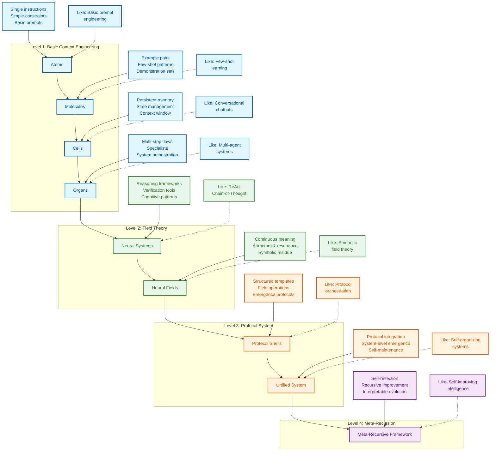

Context-Engineering 是一个让人非常难忘的repo, 其中丰富的洞见对我产生了很多启发。为了让中文社区也能够快速接触这一门前沿的艺术与工程科学，我花费了些功夫进行了中英双语翻译，保留英文原文能够让人更好地体会到原文的精妙之处(快速翻译主要应该归功于 Chrome插件:沉浸式翻译).

Context-Engineering is an extremely memorable repository, and the abundant insights within it have inspired me a lot. In order to enable the Chinese community to quickly access this cutting-edge art and engineering science, I have made some efforts to carry out a bilingual translation,retaining the original English can help people better appreciate the ingenuity of the original text.（The quick translation should mainly be attributed to the Chrome plugin : immersive-translate-trans.）

# Context Engineering
环境工程


> **"Context engineering is the delicate art and science of filling the context window with just the right information for the next step." — [**Andrej Karpathy**](https://x.com/karpathy/status/1937902205765607626)
> “情境工程是一门微妙的艺术和科学，它为下一步提供了正确的信息。”[](https://x.com/karpathy/status/1937902205765607626)**
> 
> [**Software Is Changing (Again) Talk @YC AI Startup School
> 软件正在（再次）改变 AI Startup School @YC 的话题**](https://www.youtube.com/watch?v=LCEmiRjPEtQ)


## [Comprehensive Course Under Construction
正在建设中的综合课程](https://github.com/davidkimai/Context-Engineering/tree/main/00_COURSE)

> ### **[From A Systematic Analysis of Over 1400 Research Papers — A Survey of Context Engineering for Large Language Models
> 来自对 1400 多篇研究论文的系统分析 — 大型语言模型的上下文工程调查](https://arxiv.org/pdf/2507.13334)**
> 
> [**Awesome Context Engineering Repo
> 很棒的上下文工程存储库**](https://github.com/Meirtz/Awesome-Context-Engineering)

Operationalizing the Latest Research on Context With First Principles & Visuals — July 2025 from ICML, IBM, NeurIPS, OHBM, and more
用第一性原理和视觉作最新的环境研究 - 2025 年 7 月来自 ICML、IBM、NeurIPS、OHBM 等

> **"Providing “cognitive tools” to GPT-4.1 increases its pass@1 performance on AIME2024 from 26.7% to 43.3%, bringing it very close to the performance of o1-preview."** — [**IBM Zurich**](https://www.arxiv.org/pdf/2506.12115)
> **“为 GPT-4.1 提供”认知工具“将其在 AIME2024 上的 pass@1 性能从 26.7% 提高到 43.3%，使其非常接近 o1-preview 的性能。”**— [**IBM 苏黎世**](https://www.arxiv.org/pdf/2506.12115)

## [`AgenticOS`](https://github.com/davidkimai/Context-Engineering/tree/main/.claude/commands)

**Support for [Claude Code](https://www.anthropic.com/claude-code) | [OpenCode](https://opencode.ai/) | [Amp](https://sourcegraph.com/amp) | [Kiro](https://kiro.dev/) | [Codex](https://openai.com/codex/) | [Gemini CLI](https://github.com/google-gemini/gemini-cli)
[Claude Code](https://www.anthropic.com/claude-code) 支持 | [开放代码](https://opencode.ai/) | [安培](https://sourcegraph.com/amp) | [基罗](https://kiro.dev/) | [手札](https://openai.com/codex/) |[Gemini CLI](https://github.com/google-gemini/gemini-cli)**

### **[IBM Zurich](https://www.arxiv.org/pdf/2506.12115) | [Quantum Semantics](https://arxiv.org/pdf/2506.10077) | [Emergent Symbolics ICML Princeton](https://openreview.net/forum?id=y1SnRPDWx4) | [MEM1 Singapore-MIT](https://arxiv.org/pdf/2506.15841) | [LLM Attractors Shanghai AI](https://arxiv.org/pdf/2502.15208?) | [MemOS Shanghai](https://github.com/MemTensor/MemOS) | [Latent Reasoning](https://arxiv.org/pdf/2507.06203) | [Dynamic Recursive Depths](https://arxiv.org/pdf/2507.10524) | [A Systematic Analysis of Over 1400 Research Papers on Context Engineering](https://arxiv.org/pdf/2507.13334)
[IBM 苏黎世](https://www.arxiv.org/pdf/2506.12115) | [量子语义](https://arxiv.org/pdf/2506.10077) |[Emergent Symbolics ICML 普林斯顿](https://openreview.net/forum?id=y1SnRPDWx4) |[MEM1 新加坡-麻省理工学院](https://arxiv.org/pdf/2506.15841) | [法学硕士吸引子上海人工智能](https://arxiv.org/pdf/2502.15208?) |[MemOS 上海](https://github.com/MemTensor/MemOS) | [潜在推理](https://arxiv.org/pdf/2507.06203) | [动态递归深度](https://arxiv.org/pdf/2507.10524) | [对 1400 多篇环境工程研究论文的系统分析](https://arxiv.org/pdf/2507.13334)**

## [Chat with NotebookLM + Podcast Deep Dive 与 NotebookLM 聊天 + 播客深入探讨](https://notebooklm.google.com/notebook/0c6e4dc6-9c30-4f53-8e1a-05cc9ff3bc7e)

## [](https://deepwiki.com/davidkimai/Context-Engineering)

A frontier, first-principles handbook for moving beyond prompt engineering to the wider discipline of context design, orchestration, and optimization.
一本前沿的第一性原理手册，从提示工程转向更广泛的上下文设计、编排和优化学科。

```
                    Prompt Engineering  │  Context Engineering
                       ↓                │            ↓                      
               "What you say"           │  "Everything else the model sees"
             (Single instruction)       │    (Examples, memory, retrieval,
                                        │     tools, state, control flow)
```

## Definition of Context Engineering
上下文工程的定义

> **Context is not just the single prompt users send to an LLM. Context is the complete information payload provided to a LLM at inference time, encompassing all structured informational components that the model needs to plausibly accomplish a given task.
> Context 不仅仅是用户发送到 LLM 的单个提示。Context 是在推理时提供给 LLM 的完整信息有效负载，包括模型合理完成给定任务所需的所有结构化信息组件。**
> 
> — [**Definition of Context Engineering from A Systematic Analysis of Over 1400 Research Papers**](https://arxiv.org/pdf/2507.13334)
> — 对 [**1400 多篇研究论文的系统分析中对情境工程的定义**](https://arxiv.org/pdf/2507.13334)

```
╭─────────────────────────────────────────────────────────────╮
│              CONTEXT ENGINEERING MASTERY COURSE             │
│                    From Zero to Frontier                    │
╰─────────────────────────────────────────────────────────────╯
                          ▲
                          │
                 Mathematical Foundations
                  C = A(c₁, c₂, ..., cₙ)
                          │
                          ▼
┌─────────────┬──────────────┬──────────────┬─────────────────┐
│ FOUNDATIONS │ SYSTEM IMPL  │ INTEGRATION  │ FRONTIER        │
│ (Weeks 1-4) │ (Weeks 5-8)  │ (Weeks 9-10) │ (Weeks 11-12)   │
└─────┬───────┴──────┬───────┴──────┬───────┴─────────┬───────┘
      │              │              │                 │
      ▼              ▼              ▼                 ▼
┌─────────────┐ ┌──────────────┐ ┌──────────────┐ ┌──────────────┐
│ Math Models │ │ RAG Systems  │ │ Multi-Agent  │ │ Meta-Recurs  │
│ Components  │ │ Memory Arch  │ │ Orchestrat   │ │ Quantum Sem  │
│ Processing  │ │ Tool Integr  │ │ Field Theory │ │ Self-Improv  │
│ Management  │ │ Agent Systems│ │ Evaluation   │ │ Collaboration│
└─────────────┘ └──────────────┘ └──────────────┘ └──────────────┘
```

## Why This Repository Exists
为什么存在此存储库

> **"Meaning is not an intrinsic, static property of a semantic expression, but rather an emergent phenomenon" — [Agostino et al. — July 2025, Indiana University](https://arxiv.org/pdf/2506.10077)
> “意义不是语义表达的内在静态属性，而是一种涌现的现象”— [Agostino 等人 — 2025 年 7 月，印第安纳大学](https://arxiv.org/pdf/2506.10077)**

Prompt engineering received all the attention, but we can now get excited for what comes next. Once you've mastered prompts, the real power comes from engineering the **entire context window** that surrounds those prompts. Guiding thought, if you will.
Prompt 工程学受到了所有的关注，但我们现在可以对接下来的事情感到兴奋。一旦你掌握了提示，真正的强大之处在于设计围绕这些提示的整个**上下文窗口** 。如果你愿意的话，这是指导思想。

This repository provides a progressive, first-principles approach to context engineering, built around a biological metaphor:
此存储库提供了一种渐进的第一性原理方法，用于上下文工程，围绕生物学隐喻构建：

```
atoms → molecules → cells → organs → neural systems → neural & semantic field theory 
  │        │         │         │             │                         │        
single    few-     memory +   multi-   cognitive tools +     context = fields +
prompt    shot     agents     agents   operating systems     persistence & resonance
```

> "Abstraction is the cost of generalization"— [**Grant Sanderson (3Blue1Brown)**](https://www.3blue1brown.com/)
> “抽象是泛化的成本”— [**Grant Sanderson （3Blue1Brown）**](https://www.3blue1brown.com/)


*[A Survey of Context Engineering - July 2025
环境工程调查 - 2025 年 7 月](https://arxiv.org/pdf/2507.13334)*

**[On Emergence, Attractors, and Dynamical Systems Theory](https://content.csbs.utah.edu/~butner/systems/DynamicalSystemsIntro.html) | [Columbia DST](http://wordpress.ei.columbia.edu/ac4/about/our-approach/dynamical-systems-theory/)
[关于涌现、吸引子和动力系统理论](https://content.csbs.utah.edu/~butner/systems/DynamicalSystemsIntro.html) | [哥伦比亚 DST](http://wordpress.ei.columbia.edu/ac4/about/our-approach/dynamical-systems-theory/)**

[https://github.com/user-attachments/assets/9f046259-e5ec-4160-8ed0-41a608d8adf3](https://github.com/user-attachments/assets/9f046259-e5ec-4160-8ed0-41a608d8adf3)




## Under Construction
正在施工中

```python
Context-Engineering/
├── LICENSE                          # MIT license
├── README.md                        # Quick-start overview
├── structure.md                     # Original structural map
├── STRUCTURE_v2.md                  # Enhanced structural map with field theory
├── context.json                     # Original schema configuration
├── context_v2.json                  # Extended schema with field protocols
├── context_v3.json                  # Neural field extensions
├── context_v3.5.json                # Symbolic mechanism integration
├── CITATIONS.md                     # Research references and bridges
│
├── 00_foundations/                  # First-principles theory
│   ├── 01_atoms_prompting.md        # Atomic instruction units
│   ├── 02_molecules_context.md      # Few-shot examples/context
│   ├── 03_cells_memory.md           # Stateful conversation layers
│   ├── 04_organs_applications.md    # Multi-step control flows
│   ├── 05_cognitive_tools.md        # Mental model extensions
│   ├── 06_advanced_applications.md  # Real-world implementations
│   ├── 07_prompt_programming.md     # Code-like reasoning patterns
│   ├── 08_neural_fields_foundations.md # Context as continuous fields
│   ├── 09_persistence_and_resonance.md # Field dynamics and attractors
│   ├── 10_field_orchestration.md    # Coordinating multiple fields
│   ├── 11_emergence_and_attractor_dynamics.md # Emergent properties
│   │── 12_symbolic_mechanisms.md    # Symbolic reasoning in LLMs
│   ├── 13_quantum_semantics.md      # Multiple meanings (Superposition)
│   └── 14_unified_field_theory.md   # Integrating theory models
│
├── 10_guides_zero_to_hero/          # Hands-on tutorials
│   ├── 01_min_prompt.ipynb          # Minimal prompt experiments
│   ├── 02_expand_context.ipynb      # Context expansion techniques
│   ├── 03_control_loops.ipynb       # Flow control mechanisms
│   ├── 04_rag_recipes.ipynb         # Retrieval-augmented patterns
│   ├── 05_protocol_bootstrap.ipynb  # Field protocol bootstrap
│   ├── 06_protocol_token_budget.ipynb # Protocol efficiency
│   ├── 07_streaming_context.ipynb   # Real-time context
│   ├── 08_emergence_detection.ipynb # Detecting emergence
│   ├── 09_residue_tracking.ipynb    # Tracking symbolic residue
│   └── 10_attractor_formation.ipynb # Creating field attractors
│
├── 20_templates/                    # Reusable components
│   ├── minimal_context.yaml         # Base context structure
│   ├── control_loop.py              # Orchestration template
│   ├── scoring_functions.py         # Evaluation metrics
│   ├── prompt_program_template.py   # Program structure template
│   ├── schema_template.yaml         # Schema definition template
│   ├── recursive_framework.py       # Recursive context template
│   ├── field_protocol_shells.py     # Field protocol templates
│   ├── symbolic_residue_tracker.py  # Residue tracking tools
│   ├── context_audit.py             # Context analysis tool
│   ├── shell_runner.py              # Protocol shell runner
│   ├── resonance_measurement.py     # Field resonance metrics
│   ├── attractor_detection.py       # Attractor analysis tools
│   ├── boundary_dynamics.py         # Boundary operation tools
│   └── emergence_metrics.py         # Emergence measurement
│
├── 30_examples/                     # Practical implementations
│   ├── 00_toy_chatbot/              # Simple conversation agent
│   ├── 01_data_annotator/           # Data labeling system
│   ├── 02_multi_agent_orchestrator/ # Agent collaboration system
│   ├── 03_vscode_helper/            # IDE integration 
│   ├── 04_rag_minimal/              # Minimal RAG implementation
│   ├── 05_streaming_window/         # Real-time context demo
│   ├── 06_residue_scanner/          # Symbolic residue demo
│   ├── 07_attractor_visualizer/     # Field visualization
│   ├── 08_field_protocol_demo/      # Protocol demonstration
│   └── 09_emergence_lab/            # Emergence experimentation
│
├── 40_reference/                    # Deep-dive documentation
│   ├── token_budgeting.md           # Token optimization strategies
│   ├── retrieval_indexing.md        # Retrieval system design
│   ├── eval_checklist.md            # PR evaluation criteria
│   ├── cognitive_patterns.md        # Reasoning pattern catalog
│   ├── schema_cookbook.md           # Schema pattern collection
│   ├── patterns.md                  # Context pattern library
│   ├── field_mapping.md             # Field theory fundamentals
│   ├── symbolic_residue_types.md    # Residue classification
│   ├── attractor_dynamics.md        # Attractor theory and practice
│   ├── emergence_signatures.md      # Detecting emergence
│   └── boundary_operations.md       # Boundary management guide
│
├── 50_contrib/                      # Community contributions
│   └── README.md                    # Contribution guidelines
│
├── 60_protocols/                    # Protocol shells and frameworks
│   ├── README.md                    # Protocol overview
│   ├── shells/                      # Protocol shell definitions
│   │   ├── attractor.co.emerge.shell      # Attractor co-emergence
│   │   ├── recursive.emergence.shell      # Recursive field emergence
│   │   ├── recursive.memory.attractor.shell # Memory persistence
│   │   ├── field.resonance.scaffold.shell  # Field resonance
│   │   ├── field.self_repair.shell        # Self-repair mechanisms
│   │   └── context.memory.persistence.attractor.shell # Context persistence
│   ├── digests/                     # Simplified protocol documentation
│   └── schemas/                     # Protocol schemas
│       ├── fractalRepoContext.v3.5.json    # Repository context
│       ├── fractalConsciousnessField.v1.json # Field schema
│       ├── protocolShell.v1.json           # Shell schema
│       ├── symbolicResidue.v1.json         # Residue schema
│       └── attractorDynamics.v1.json       # Attractor schema
│
├── 70_agents/                       # Agent demonstrations
│   ├── README.md                    # Agent overview
│   ├── 01_residue_scanner/          # Symbolic residue detection
│   ├── 02_self_repair_loop/         # Self-repair protocol
│   ├── 03_attractor_modulator/      # Attractor dynamics
│   ├── 04_boundary_adapter/         # Dynamic boundary tuning
│   └── 05_field_resonance_tuner/    # Field resonance optimization
│
├── 80_field_integration/            # Complete field projects
│   ├── README.md                    # Integration overview
│   ├── 00_protocol_ide_helper/      # Protocol development tools
│   ├── 01_context_engineering_assistant/ # Field-based assistant
│   ├── 02_recursive_reasoning_system/    # Recursive reasoning
│   ├── 03_emergent_field_laboratory/     # Field experimentation
│   └── 04_symbolic_reasoning_engine/     # Symbolic mechanisms
│
├── cognitive-tools/                 # Advanced cognitive framework
│   ├── README.md                    # Overview and quick-start guide
│   ├── cognitive-templates/         # Templates for reasoning
│   │   ├── understanding.md         # Comprehension operations
│   │   ├── reasoning.md             # Analytical operations
│   │   ├── verification.md          # Checking and validation
│   │   ├── composition.md           # Combining multiple tools
│   │   └── emergence.md             # Emergent reasoning patterns
│   │
│   ├── cognitive-programs/          # Structured prompt programs
│   │   ├── basic-programs.md        # Fundamental program structures
│   │   ├── advanced-programs.md     # Complex program architectures
│   │   ├── program-library.py       # Python implementations
│   │   ├── program-examples.ipynb   # Interactive examples
│   │   └── emergence-programs.md    # Emergent program patterns
│   │
│   ├── cognitive-schemas/           # Knowledge representations
│   │   ├── user-schemas.md          # User information schemas
│   │   ├── domain-schemas.md        # Domain knowledge schemas
│   │   ├── task-schemas.md          # Reasoning task schemas
│   │   ├── schema-library.yaml      # Reusable schema library
│   │   └── field-schemas.md         # Field representation schemas
│   │
│   ├── cognitive-architectures/     # Complete reasoning systems
│   │   ├── solver-architecture.md   # Problem-solving systems
│   │   ├── tutor-architecture.md    # Educational systems
│   │   ├── research-architecture.md # Information synthesis
│   │   ├── architecture-examples.py # Implementation examples
│   │   └── field-architecture.md    # Field-based architectures
│   │
│   └── integration/                 # Integration patterns
│       ├── with-rag.md              # Integration with retrieval
│       ├── with-memory.md           # Integration with memory
│       ├── with-agents.md           # Integration with agents
│       ├── evaluation-metrics.md    # Effectiveness measurement
│       └── with-fields.md           # Integration with field protocols
│
└── .github/                         # GitHub configuration
    ├── CONTRIBUTING.md              # Contribution guidelines
    ├── workflows/ci.yml             # CI pipeline configuration
    ├── workflows/eval.yml           # Evaluation automation
    └── workflows/protocol_tests.yml # Protocol testing
```

## Quick Start
快速开始

1.  **Read `00_foundations/01_atoms_prompting.md`** (5 min)
    **阅读 `00_foundations/01_atoms_prompting.md`** （5 分钟）
    Understand why prompts alone often underperform
    了解为什么单独的提示经常表现不佳
    
2.  **Run `10_guides_zero_to_one/01_min_prompt.py (Jupyter Notebook style)`
    跑 `10_guides_zero_to_one/01_min_prompt.py (Jupyter Notebook style)`**
    Experiment with a minimal working example
    尝试使用最小工作示例
    
3.  **Explore `20_templates/minimal_context.yaml`
    探讨 `20_templates/minimal_context.yaml`**
    Copy/paste a template into your own project
    将模板复制/粘贴到您自己的项目中
    
4.  **Study `30_examples/00_toy_chatbot/`
    书 `30_examples/00_toy_chatbot/`**
    See a complete implementation with context management
    查看具有上下文管理的完整实施
    

## Learning Path
学习路径

```
┌─────────────────┐     ┌──────────────────┐     ┌────────────────┐
│ 00_foundations/ │     │ 10_guides_zero_  │     │ 20_templates/  │
│                 │────▶│ to_one/          │────▶│                │
│ Theory & core   │     │ Hands-on         │     │ Copy-paste     │
│ concepts        │     │ walkthroughs     │     │ snippets       │
└─────────────────┘     └──────────────────┘     └────────────────┘
         │                                                │
         │                                                │
         ▼                                                ▼
┌─────────────────┐                             ┌────────────────┐
│ 40_reference/   │◀───────────────────────────▶│ 30_examples/   │
│                 │                             │                │
│ Deep dives &    │                             │ Real projects, │
│ eval cookbook   │                             │ progressively  │
└─────────────────┘                             │ complex        │
         ▲                                      └────────────────┘
         │                                                ▲
         │                                                │
         └────────────────────┐               ┌───────────┘
                              ▼               ▼
                         ┌─────────────────────┐
                         │ 50_contrib/         │
                         │                     │
                         │ Community           │
                         │ contributions       │
                         └─────────────────────┘
```

## What You'll Learn
您将学到什么

| Concept概念 | What It Is它是什么 | Why It Matters为什么重要 |
| --- | --- | --- |
| Token Budget代币预算 | Optimizing every token in your context优化上下文中的每个令牌 | More tokens = more $$ and slower responses更多的代币 = 更多的 $$ 和更慢的响应 |
| Few-Shot LearningFew-Shot 学习 | Teaching by showing examples通过示例进行教学 | Often works better than explanation alone通常比单独解释效果更好 |
| Memory Systems内存系统 | Persisting information across turns跨轮次保留信息 | Enables stateful, coherent interactions支持有状态、连贯的交互 |
| Retrieval Augmentation检索增强 | Finding & injecting relevant documents寻找并注入相关文件 | Grounds responses in facts, reduces hallucination以事实为基础做出反应，减少幻觉 |
| Control Flow控制流 | Breaking complex tasks into steps将复杂任务分解为多个步骤 | Solve harder problems with simpler prompts使用更简单的提示解决更难的问题 |
| Context Pruning上下文修剪 | Removing irrelevant information删除不相关的信息 | Keep only what's necessary for performance仅保留性能所需的内容 |
| Metrics & Evaluation指标和评估 | Measuring context effectiveness衡量上下文有效性 | Iterative optimization of token use vs. quality令牌使用与质量的迭代优化 |
| Cognitive Tools & Prompt Programming认知工具和提示编程 | Learm to build custom tools and templatesLearm 构建自定义工具和模板 | Prompt programming enables new layers for context engineering提示编程为上下文工程启用新层 |
| Neural Field Theory神经场论 | Context as a Neural Field作为神经场的上下文 | Modeling context as a dynamic neural field allows for iterative context updating将上下文建模为动态神经场允许迭代上下文更新 |
| Symbolic Mechanisms符号机制 | Symbolic architectures enable higher order reasoning符号架构支持高阶推理 | Smarter systems = less work更智能的系统 = 更少的工作量 |
| Quantum Semantics量子语义 | Meaning as observer-dependent含义 as observer-dependent | Design context systems leveraging superpositional techniques利用叠加技术设计上下文系统 |

## Karpathy + 3Blue1Brown Inspired Style
Karpathy + 3Blue1Brown 风格

> For learners of all experience levels
> 适合所有经验水平的学习者

1.  **First principles** – start with the fundamental context
    **基本原则** – 从基本环境开始
2.  **Iterative add-on** – add only what the model demonstrably lacks
    **迭代插件** – 仅添加模型明显缺少的内容
3.  **Measure everything** – token cost, latency, quality score
    **衡量一切** – 令牌成本、延迟、质量分数
4.  **Delete ruthlessly** – pruning beats padding
    **无情地删除** – 修剪胜于填充
5.  **Code > slides** – every concept has a runnable cell
    **代码 > 幻灯片** – 每个概念都有一个可运行的单元格
6.  **Visualize everything** — every concept is visualized with ASCII and symbolic diagrams
    **可视化一切** — 每个概念都通过 ASCII 和符号图可视化

# Research Evidence
研究证据

## Memory + Reasoning
记忆 + 推理

### **[MEM1: Learning to Synergize Memory and Reasoning for Efficient Long-Horizon Agents - Singapore-MIT June 2025
MEM1：学习协同记忆和推理以实现高效的长视野代理 - 新加坡-麻省理工学院 2025 年 6 月](https://www.arxiv.org/pdf/2506.15841)**

> “Our results demonstrate the promise of reasoning-driven memory consolidation as a scalable alternative to existing solutions for training long-horizon interactive agents, where both efficiency and performance are optimized." — [Singapore-MIT](https://arxiv.org/pdf/2506.15841)
> “我们的结果表明，推理驱动的内存整合有望成为现有解决方案的可扩展替代方案，用于训练长视野交互式代理，其中效率和性能都得到了优化。”[](https://arxiv.org/pdf/2506.15841)


1.  **MEM1 trains AI agents to keep only what matters—merging memory and reasoning at every step—so they never get overwhelmed, no matter how long the task.
    MEM1 训练 AI 代理只保留重要内容，在每一步都融合内存和推理，因此无论任务多长时间，它们都不会不堪重负。**
    
2.  **Instead of piling up endless context, MEM1 compresses each interaction into a compact “internal state,” just like a smart note that gets updated, not recopied.
    MEM1 不是堆积无休止的上下文，而是将每次交互压缩成一个紧凑的“内部状态”，就像一个更新而不是复制的智能笔记。**
    
3.  **By blending memory and thinking into a single flow, MEM1 learns to remember only the essentials—making agents faster, sharper, and able to handle much longer conversations.
    通过将记忆和思维融合到一个流程中，MEM1 学会了只记住基本要素，从而使座席更快、更敏锐，并能够处理更长的对话。**
    
4.  **Everything the agent does is tagged and structured, so each action, question, or fact is clear and easy to audit—no more mystery meat memory.
    代理所做的一切都是标记和结构化的，因此每个动作、问题或事实都清晰易懂——不再有神秘的肉记忆。**
    
5.  **With every cycle, old clutter is pruned and only the latest, most relevant insights are carried forward, mirroring how expert problem-solvers distill their notes.
    在每个周期中，旧的杂物都会被修剪掉，只使用最新、最相关的见解，这反映了问题解决专家如何提炼他们的笔记。**
    
6.  **MEM1 proves that recursive, protocol-driven memory—where you always refine and integrate—outperforms traditional “just add more context” approaches in both speed and accuracy.
    MEM1 证明，递归、协议驱动的内存（您总是在其中进行改进和集成）在速度和准确性上都优于传统的“添加更多上下文”方法。**
    

## Cognitive Tools
认知工具

### **[Eliciting Reasoning in Language Models with Cognitive Tools - IBM Zurich June 2025
使用认知工具在语言模型中引出推理 - IBM 苏黎世，2025 年 6 月](https://www.arxiv.org/pdf/2506.12115)**

### Prompts and Prompt Programs as Reasoning Tool Calls
提示符和提示程序作为推理工具调用

> “Cognitive tools” encapsulate reasoning operations within the LLM itself — [IBM Zurich](https://www.arxiv.org/pdf/2506.12115)
> “认知工具”将推理作封装在 LLM 本身中 — [IBM 苏黎世](https://www.arxiv.org/pdf/2506.12115)


> **These cognitive tools (structured prompt templates as tool calls) break down the problem by identifying the main concepts at hand, extracting relevant information in the question, and highlighting meaningful properties, theorems, and techniques that might be helpful in solving the problem.
> 这些认知工具（作为工具调用的结构化提示模板）通过识别手头的主要概念、提取问题中的相关信息以及突出显示可能有助于解决问题的有意义的属性、定理和技术来分解问题。**


> **These templates scaffold reasoning layers similar to cognitive mental shortcuts, commonly studied as "heuristics".
> 这些模板支撑着类似于认知心理捷径的推理层，通常被称为 “启发式”。**

1.  **This research shows that breaking complex tasks into modular “cognitive tools” lets AI solve problems more thoughtfully—mirroring how expert humans reason step by step.
    这项研究表明，将复杂任务分解为模块化的“认知工具”可以让 AI 更周到地解决问题，这反映了专家级人类如何逐步推理。**
    
2.  **Instead of relying on a single, big prompt, the model calls specialized prompt templates, aka cognitive tools like “understand question,” “recall related,” “examine answer,” and “backtracking”—each handling a distinct mental operation.
    该模型不依赖于单个大型提示，而是调用专门的提示模板，也就是“理解问题”、“回忆相关”、“检查答案”和“回溯”等认知工具——每个模板都处理不同的心理作。**
    
3.  **Cognitive tools work like inner mental shortcuts: the AI picks the right program at each stage and runs it to plan its reasoning and downstream actions before conducting the task for greater accuracy and flexibility.
    认知工具就像内在的心理捷径一样：AI 在每个阶段选择正确的程序，并在执行任务之前运行它来规划其推理和下游行动，以提高准确性和灵活性。**
    
4.  **By compartmentalizing reasoning steps into modular blocks, these tools prevent confusion, reduce error, and make the model’s thought process transparent and auditable—even on hard math problems.
    通过将推理步骤划分为模块化块，这些工具可以防止混淆、减少错误，并使模型的思维过程透明且可审计——即使是在困难的数学问题上也是如此。**
    
5.  **This modular approach upgrades both open and closed models—boosting real-world math problem-solving and approaching the performance of advanced RL-trained “reasoning” models, without extra training.
    这种模块化方法升级了开放和封闭模型，无需额外培训即可提高实际数学问题解决能力，并接近高级 RL 训练的“推理”模型的性能。**
    
6.  **The results suggest that the seeds of powerful reasoning are already inside large language models—cognitive tools simply unlock and orchestrate these abilities, offering a transparent, efficient, and interpretable alternative to black-box tuning.
    结果表明，强大推理的种子已经在大型语言模型中——认知工具简单地解锁和编排这些能力，为黑盒调优提供了一种透明、高效且可解释的替代方案。**
    

## Emergent Symbols
紧急符号

## **[Emergent Symbolic Mechanisms Support Abstract Reasoning in Large Language Models - ICML Princeton June 18, 2025
涌现符号机制支持大型语言模型中的抽象推理 - ICML Princeton 2025 年 6 月 18 日](https://openreview.net/forum?id=y1SnRPDWx4)**


> **TL;DR: A three-stage architecture is identified that supports abstract reasoning in LLMs via a set of emergent symbol-processing mechanisms.
> TL;DR：确定了一种三阶段架构，它通过一组新兴的符号处理机制支持 LLM 中的抽象推理。**

**These include symbolic induction heads, symbolic abstraction heads, and retrieval heads.
这些包括符号归纳头、符号抽象头和检索头。**

**1\. In early layers, symbol abstraction heads convert input tokens to abstract variables based on the relations between those tokens.
1\. 在早期层中，符号抽象头根据这些 token 之间的关系将 input token 转换为抽象变量。**

**2\. In intermediate layers, symbolic induction heads perform sequence induction over these abstract variables.
2\. 在中间层中，符号归纳头对这些抽象变量执行序列归纳。**

**3\. Finally, in later layers, retrieval heads predict the next token by retrieving the value associated with the predicted abstract variable.
3\. 最后，在后面的层中，检索头通过检索与预测的抽象变量关联的值来预测下一个标记。**

**These results point toward a resolution of the longstanding debate between symbolic and neural network approaches, suggesting that emergent reasoning in neural networks depends on the emergence of symbolic mechanisms.** — [**ICML Princeton**](https://openreview.net/forum?id=y1SnRPDWx4)
**这些结果指向了符号和神经网络方法之间长期争论的解决，表明神经网络中的涌现推理取决于符号机制的出现。**— [**ICML 普林斯顿**](https://openreview.net/forum?id=y1SnRPDWx4)


> **Why Useful?
> 为什么有用？**
> 
> **This supports why Markdown, Json, and similar structured, symbolic formats are more easily LLM parsable
> 这支持了为什么 Markdown、Json 和类似的结构化符号格式更容易进行 LLM 解析**
> 
> **Concept: Collaborate with agents to apply delimiters, syntax, symbols, symbolic words, metaphors and structure to improve reasoning/context/memory/persistence during inference
> 概念：与代理合作应用分隔符、语法、符号、符号词、隐喻和结构，以改善推理过程中的推理/上下文/记忆/持久性**

1.  **This paper proves that large language models develop their own inner symbolic “logic circuits”—enabling them to reason with abstract variables, not just surface word patterns.
    本文证明，大型语言模型开发了自己的内部符号“逻辑电路”——使它们能够使用抽象变量进行推理，而不仅仅是表面的单词模式。**
    
2.  **LLMs show a three-stage process: first abstracting symbols from input, then reasoning over these variables, and finally mapping the abstract answer back to real-world tokens.
    LLM 展示了一个三阶段的过程：首先从输入中抽象符号，然后对这些变量进行推理，最后将抽象答案映射回现实世界的标记。**
    
3.  **These emergent mechanisms mean LLMs don’t just memorize—they actually create internal, flexible representations that let them generalize to new problems and analogies.
    这些涌现的机制意味着 LLM 不仅仅是记忆——它们实际上创造了内部的、灵活的表示，让它们能够推广到新的问题和类比。**
    
4.  **Attention heads in early layers act like “symbol extractors,” intermediate heads perform symbolic reasoning, and late heads retrieve the concrete answer—mirroring human-like abstraction and retrieval.
    早期层次的注意力头就像“符号提取器”，中间头执行符号推理，而后期头则检索具体答案——反映了类似人类的抽象和检索。**
    
5.  **By running targeted experiments and interventions, the authors show these symbolic processes are both necessary and sufficient for abstract reasoning, across multiple models and tasks.
    通过进行有针对性的实验和干预，作者表明这些符号过程对于跨多个模型和任务的抽象推理既必要又足够。**
    
6.  **The results bridge the historic gap between symbolic AI and neural nets—showing that, at scale, neural networks can invent and use symbolic machinery, supporting real generalization and reasoning.
    结果弥合了符号 AI 和神经网络之间的历史差距，表明神经网络可以大规模地发明和使用符号机制，支持真正的泛化和推理。**
    

## Star History
Star 历史

[](https://www.star-history.com/#davidkimai/Context-Engineering&Date)

## Contributing
贡献

We welcome contributions! Check out [CONTRIBUTING.md](.github/CONTRIBUTING.md) for guidelines.
我们欢迎贡献！查看 [CONTRIBUTING.md](.github/CONTRIBUTING.md) 获取指南。

## License
许可证

[MIT License
MIT 许可证](LICENSE)

## Citation
引文

```bibtex
@misc{context-engineering,
  author = {Context Engineering Contributors},
  title = {Context Engineering: Beyond Prompt Engineering},
  year = {2025},
  publisher = {GitHub},
  url = {https://github.com/davidkimai/context-engineering}
}
```

## Acknowledgements
确认

> I've been looking forward to this being conceptualized and formalized as there wasn't a prior established field. Prompt engineering receives quite the stigma and doesn't quite cover what most researchers and I do.
> 我一直期待着它被概念化和正式化，因为之前没有一个既定的领域。Prompt Engineering 受到了相当大的耻辱，并且没有完全涵盖大多数研究人员和我所做的工作。

*   [Andrej Karpathy](https://x.com/karpathy/status/1937902205765607626) for coining "context engineering" and inspiring this repo
    [Andrej Karpathy](https://x.com/karpathy/status/1937902205765607626) 创造了“上下文工程”并启发了这个存储库
*   All contributors and the open source community
    所有贡献者和开源社区
